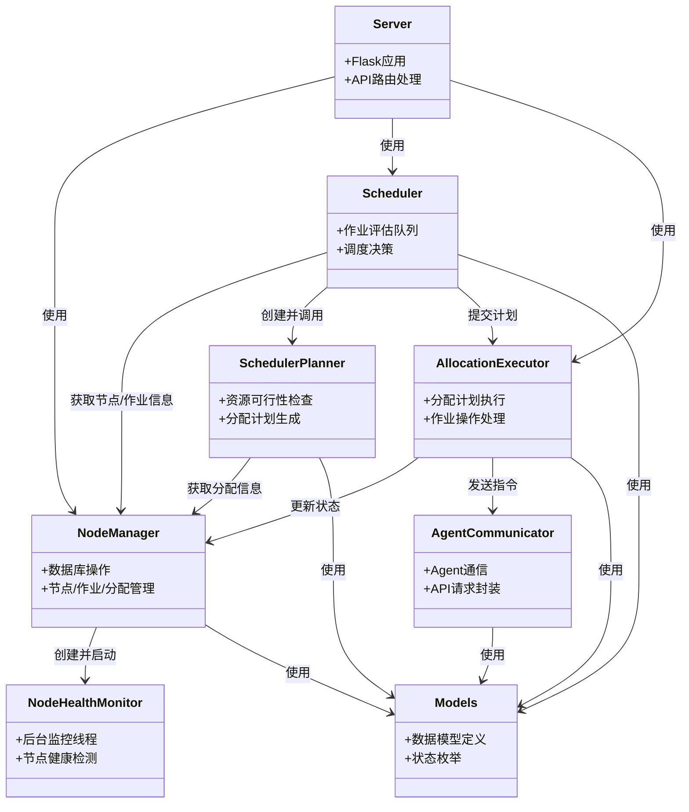

# myNomad - 分布式任务调度系统

myNomad是一个轻量级分布式任务调度系统，参考了HashiCorp Nomad的设计理念，用于在分布式环境中高效地调度和管理工作负载。它支持容器和进程两种任务类型，提供了简单而强大的任务编排功能。

## 系统架构

myNomad采用主从架构，主要包含以下组件：

- **服务器(Server)**: 作为控制平面，负责接收API请求，存储系统状态，调度任务。
- **节点管理器(NodeManager)**: 管理集群中的所有节点、作业和分配信息，维护系统状态。
- **调度器(Scheduler)**: 根据作业配置和可用资源做出调度决策，将任务组分配到合适的节点。
- **节点代理(NodeAgent)**: 部署在每个工作节点上，负责执行分配的任务，并向服务器报告心跳和任务状态。

### 核心概念

- **作业(Job)**: 用户提交的工作单元，包含一个或多个任务组。
- **任务组(Task Group)**: 一组需要在同一节点上一起调度的相关任务。
- **任务(Task)**: 最小的执行单元，可以是容器或进程。
- **分配(Allocation)**: 任务组在特定节点上的实例化，是调度的结果。

## 核心组件职责与依赖

下面列出了myNomad系统中的核心组件及其主要职责和依赖关系。

### Server (Flask App - `server.py`)
-   **职责**: 提供RESTful API接口，作为系统的入口点。它接收来自用户或其他服务的请求，并将这些请求路由到相应的内部组件（如`NodeManager`, `Scheduler`, `AllocationExecutor`）进行处理。负责请求的解析、参数校验以及响应的格式化。
-   **依赖**:
    -   `Flask` (Web框架)
    -   `NodeManager` (用于节点、作业、分配的数据管理和状态查询)
    -   `Scheduler` (用于创建和提交作业评估)
    -   `AllocationExecutor` (用于注册Agent端点、停止和删除作业)

### NodeManager (`node_manager.py`)
-   **职责**: 作为集群状态的权威数据存储。它负责管理所有节点、作业和分配的元数据，这些数据持久化在SQLite数据库中。它提供了对这些数据的增删改查接口，并处理节点注册和心跳更新。同时，它初始化并启动`NodeHealthMonitor`。
-   **依赖**:
    -   `NodeHealthMonitor` (实例化并启动，用于节点健康监控)
    -   `sqlite3` (直接与数据库交互)
    -   `models.JobStatus`, `models.Allocation` (用于数据模型和状态定义)

### NodeHealthMonitor (`node_manager.py`)
-   **职责**: 独立于`NodeManager`运行，在后台线程中持续监控所有注册节点的健康状态。通过检查节点的最后心跳时间，如果节点在预设的超时时间内未报告心跳，则将其标记为不健康。对于不健康节点上的活动分配，它会将其状态更新为'lost'，并相应地调整相关作业的状态。
-   **依赖**:
    -   `sqlite3` (直接与数据库交互以更新节点、分配和作业状态)
    -   `threading` (用于后台监控循环)
    -   `time` (用于心跳超时计算)

### Scheduler (`scheduler.py`)
-   **职责**: 负责接收作业提交和更新请求，并为这些请求创建评估（`SchedulerPlanner`实例）。它管理一个评估队列，并按顺序处理这些评估。处理评估时，它调用`SchedulerPlanner`来生成分配计划，然后将此计划（包括要创建的新分配和要删除的旧分配）提交给`AllocationExecutor`执行。
-   **依赖**:
    -   `NodeManager` (获取健康节点列表、作业信息、提交/更新作业元数据)
    -   `AllocationExecutor` (通过setter注入依赖，用于提交生成的分配计划)
    -   `SchedulerPlanner` (实例化并调用其`process`方法来生成调度计划)
    -   `models.Job`, `models.TriggerEvent`, `models.EvaluationStatus` (用于数据模型和状态定义)
    -   `queue` (管理待处理的评估)
    -   `threading` (运行后台调度循环)

### SchedulerPlanner (`scheduler_planner.py`)
-   **职责**: 代表一次具体的调度评估过程。它接收作业定义、当前节点快照和触发事件（如作业提交或更新）。其核心任务是根据作业的任务组需求、节点资源、约束条件以及现有分配（如果是作业更新）来制定一个详细的分配计划。此计划包含需要新创建的分配列表和需要被删除的现有分配ID列表。它执行可行性检查（节点是否满足任务组需求）和节点排序（选择最佳节点）。
-   **依赖**:
    -   `NodeManager` (在`process`方法中被传入，用于获取作业的现有分配信息)
    -   `models.EvaluationStatus`, `models.Job`, `models.Allocation`, `models.TriggerEvent`, `models.TaskGroup`, `models.Task` (广泛用于内部逻辑和数据表示)
    -   `uuid` (生成新分配的ID)
    -   `json` (用于节点数据的深拷贝和资源字符串的解析)

### AllocationExecutor (`allocation_executor.py`)
-   **职责**: 负责执行由`Scheduler`提交的分配计划。它管理一个计划队列，按顺序处理这些计划。对于要创建的分配，它通过`AgentCommunicator`与目标节点上的Agent通信，指示Agent启动任务。对于要删除的分配，它也通过`AgentCommunicator`通知Agent停止任务，并调用`NodeManager`更新数据库中的分配和作业状态。它还负责处理停止和删除整个作业的请求。
-   **依赖**:
    -   `NodeManager` (更新分配状态、删除分配记录、停止作业、清理作业数据)
    -   `AgentCommunicator` (实例化并用于向Agent发送启动/停止分配的指令)
    -   `models.Allocation`, `models.AllocationStatus` (用于数据模型和状态定义)
    -   `queue` (管理待执行的分配计划)
    -   `threading` (运行后台计划处理循环)

### AgentCommunicator (`agent_communicator.py`)
-   **职责**: 封装了与各个节点上运行的Agent进行HTTP通信的逻辑。它维护一个节点ID到其Agent API端点的映射。当需要创建或停止分配时，`AllocationExecutor`会使用它来向相应的Agent发送HTTP请求。
-   **依赖**:
    -   `requests` (用于执行HTTP请求)
    -   `models.Allocation` (用于构建发送给Agent的请求体)

### Models (`models.py`)
-   **职责**: 定义了系统中所有核心业务对象的数据结构（如`Job`, `TaskGroup`, `Task`, `Allocation`）以及各种状态的枚举类型（如`JobStatus`, `AllocationStatus`, `EvaluationStatus`, `TaskStatus`, `TriggerEvent`）。这个模块是其他所有业务逻辑组件的基础，提供了统一的数据模型。
-   **依赖**: 无核心组件依赖。

## 组件依赖关系图

下面的图表展示了myNomad各核心组件之间的依赖关系，箭头方向表示"依赖"关系（A → B表示A依赖B）。



这个依赖图清晰展示了系统各组件间的交互关系，有助于理解整个系统的协作方式。可以看出`NodeManager`是多个组件的共同依赖，是系统的核心数据管理组件；而`Models`则是基础数据模型，被大多数组件使用。

## 功能特性

- **多驱动支持**：支持Docker容器和本地进程两种执行方式
- **资源管理**：跟踪CPU、内存等资源使用情况，确保合理分配
- **健康监控**：通过心跳机制监控节点健康状态
- **状态追踪**：实时跟踪作业、分配和任务的执行状态
- **容错机制**：检测节点故障并标记相关任务为丢失状态
- **RESTful API**：提供全面的API接口用于系统管理和操作

## 快速开始

### 前提条件

- Python 3.7+
- SQLite3
- Docker (可选，用于容器任务)

### 安装依赖

```bash
pip install flask flask_cors psutil requests uuid docker
```

### 启动服务器

```bash
python server.py
```

服务器默认在端口8500上启动。

### 启动节点代理

```bash
# 在不同的主机上启动节点代理，连接到服务器
python agent.py
```

节点代理默认在端口8501上启动，并自动向服务器注册。

## 提交作业

### 容器任务示例

```bash
curl -X POST http://localhost:8500/jobs -H "Content-Type: application/json" -d '{
  "task_groups": [
    {
      "name": "web_server",
      "count": 1,
      "tasks": [
        {
          "name": "nginx",
          "resources": {
            "cpu": 100,
            "memory": 256
          },
          "config": {
            "image": "nginx:latest",
            "port": 8080
          }
        }
      ]
    }
  ]
}'
```

### 进程任务示例

```bash
curl -X POST http://localhost:8500/jobs -H "Content-Type: application/json" -d '{
  "task_groups": [
    {
      "name": "data_processor",
      "count": 1,
      "tasks": [
        {
          "name": "processor",
          "resources": {
            "cpu": 200,
            "memory": 512
          },
          "config": {
            "command": "python process_data.py"
          }
        }
      ]
    }
  ]
}'
```

## API接口

### 服务器API

| 接口 | 方法 | 描述 |
|------|------|------|
| `/register` | POST | 节点注册 |
| `/heartbeat` | POST | 处理节点心跳 |
| `/jobs` | POST | 提交新作业 |
| `/jobs` | GET | 获取所有作业信息 |
| `/jobs/{job_id}` | GET | 获取特定作业详情 |
| `/jobs/{job_id}` | PUT | 更新现有作业 |
| `/jobs/{job_id}` | DELETE | 停止作业 |
| `/jobs/{job_id}/delete` | POST | 删除作业及其资源 |
| `/jobs/{job_id}/restart` | POST | 重启已停止的作业 |
| `/nodes` | GET | 获取所有节点信息 |

### 节点代理API

| 接口 | 方法 | 描述 |
|------|------|------|
| `/allocations` | POST | 接收新的分配 |
| `/allocations/{allocation_id}` | GET | 获取分配状态 |
| `/allocations/{allocation_id}` | DELETE | 停止并移除分配 |

## 监控和管理

通过服务器API可以监控作业和节点的状态：

```bash
# 获取所有作业信息
curl http://localhost:8500/jobs

# 获取所有节点信息
curl http://localhost:8500/nodes

# 获取特定作业详情
curl http://localhost:8500/jobs/{job_id}
```

## 系统要求

- **服务器**：任何能运行Python的系统
- **节点**：支持Docker的Linux、macOS或Windows系统
- **网络**：节点需要能够访问服务器的API端点
- **资源**：根据预期工作负载调整，基本环境较轻量

## 开发与扩展

myNomad采用模块化设计，可以通过扩展以下组件添加更多功能：

1. 添加新的任务驱动（除了容器和进程）
2. 实现更复杂的调度算法
3. 添加更多资源类型的支持
4. 实现集群安全认证机制

## 注意事项

- 本系统设计用于学习和演示目的
- 生产环境使用前请确保添加适当的安全机制
- 系统状态存储在SQLite数据库中，可考虑使用更强大的数据库系统 